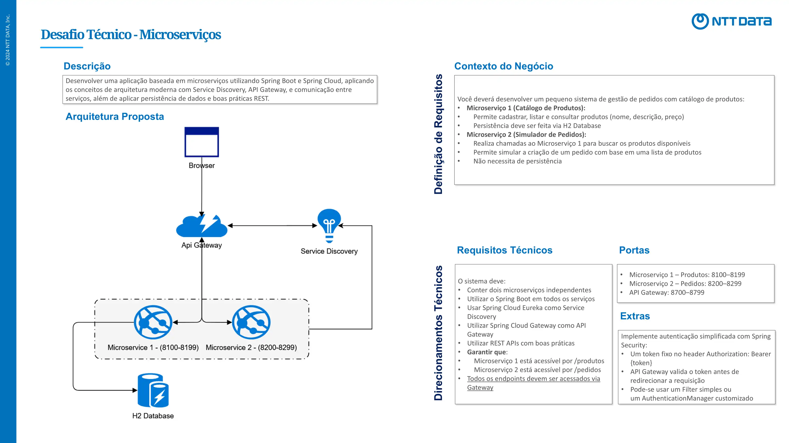

# 🚀 Desafio do Bootcamp NTT Data JV Backend para Iniciantes

## 💡 Desafio Proposto

## 🎯 Objetivo

Criar um simulador de pedidos e cadastro de produtos utilizando arquitetura de microsserviços com **Spring Boot** e **Spring Cloud**.

---

## 🧱 Descrição do Projeto

O projeto é composto por dois microsserviços acessíveis via **API Gateway**, nos seguintes endpoints:

- `/produtos`
- `/pedidos`

---

## 🗂️ Estrutura do Projeto

O sistema é dividido em módulos, cada um com uma função específica:

- **configserver**: Responsável por armazenar as configurações centralizadas dos demais serviços.
- **discovery**: Serviço de descoberta de microsserviços registrados (Eureka).
- **gateway**: API pública que permite o acesso externo aos serviços.
- **order**: Microsserviço responsável pela gestão de pedidos.
- **product**: Microsserviço responsável pela gestão de produtos.

---

## 🛠️ Tecnologias Utilizadas

- Java 24
- Spring Boot
- Spring Cloud
- Spring Cloud Config
- Spring Cloud Gateway
- Eureka Server
- OpenFeign
- Flyway
- Gradle 8.14
- Lombok
- H2 Database (em memória)
- Zipkin
- Keycloak

---

## 📡 API

### 📦 Produtos

| Método | Endpoint          | Descrição                                 |
|--------|-------------------|-------------------------------------------|
| POST   | `/produtos`       | Cadastra um novo produto                  |
| GET    | `/produtos`       | Retorna a lista de produtos cadastrados   |
| GET    | `/produtos/{id}`  | Retorna os detalhes de um produto         |
| PUT    | `/produtos/{id}`  | Atualiza as informações de um produto     |
| DELETE | `/produtos/{id}`  | Remove um produto do sistema              |

### 🧾 Pedidos

| Método | Endpoint         | Descrição                                  |
|--------|------------------|--------------------------------------------|
| POST   | `/pedidos`       | Realiza o cadastro de um novo pedido       |
| GET    | `/pedidos`       | Retorna a lista de pedidos cadastrados     |
| GET    | `/pedidos/{id}`  | Retorna os detalhes de um pedido específico|

---

## como executar 

A maneira mais fácil é usando o Intellij e abrir o projeto pelo mesmo.

## como fazer o deploy

